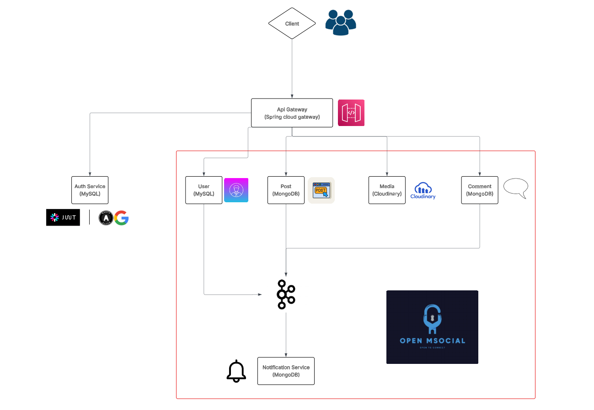

# 🌐 Open MSocial - Social Media Platform

Open MSocial is a comprehensive social media platform built using a microservices architecture. This project demonstrates modern software development practices with a focus on scalability, security, and user experience.

## 📌 Project Overview

Open MSocial allows users to:
- Create and manage profiles
- Connect with friends
- Create posts and share media
- Comment on content
- Receive notifications

## 🏗️ Architecture Overview



The platform follows a microservices architecture with the following components:

### 🔀 API Gateway
Central entry point that routes all client requests to appropriate services and handles cross-cutting concerns like authentication.

### 🛡️ Identity Service
Manages user authentication, authorization, and account management.

### 👤 Profile Service
Handles user profile data and social connections (friends, followers).

### 📝 Post Service
Manages the creation and retrieval of posts.

### 💬 Comment Service
Handles comments on posts and other content.

### 🖼️ Media Service
Manages media files (images, videos) uploaded by users.

### 🔔 Notification Service
Manages and delivers notifications to users.

### 🖥️ Web Application
Frontend interface for users to interact with the platform.

## 🚀 Getting Started

### Prerequisites
- Docker and Docker Compose (recommended for easy setup)
- Alternatively:
  - Java 21
  - Node.js and npm
  - Maven
  - MySQL
  - MongoDB
  - Kafka

### Running with Docker (Recommended)

The easiest way to run the entire Open MSocial platform is using Docker Compose:

```bash
# Clone the repository
git clone https://github.com/TuanVuNguyen89/open-msocial.git
cd open-msocial

# Build and start all services
docker-compose up
```

This will:
1. Set up all required infrastructure (MySQL, MongoDB, Kafka, Zookeeper)
2. Build and start all backend microservices
3. Build and start the frontend web application
4. Configure networking between all components

The application will be available at:
- Frontend: http://localhost:80
- API Gateway: http://localhost:8888/api/v1

For Cloudinary integration (media service), set these environment variables before running:
```bash
export CLOUDINARY_CLOUD_NAME=your-cloud-name
export CLOUDINARY_API_KEY=your-api-key
export CLOUDINARY_API_SECRET=your-api-secret
```

### Running Without Docker (Manual Setup)

1. Start the backend services in the following order:
   - Identity Service
   - Profile Service
   - Post Service
   - Comment Service
   - Media Service
   - Notification Service
   - API Gateway

2. Start the frontend application:
   - Web Application

See individual service README files for detailed manual setup instructions.
